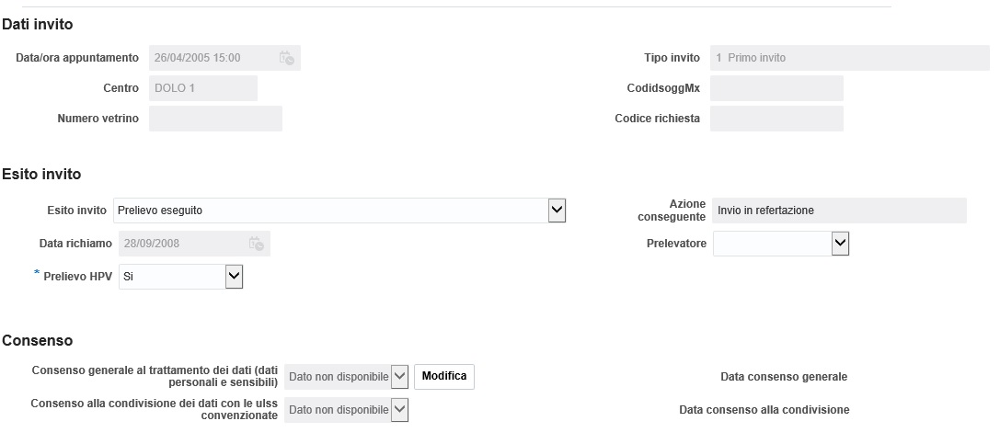
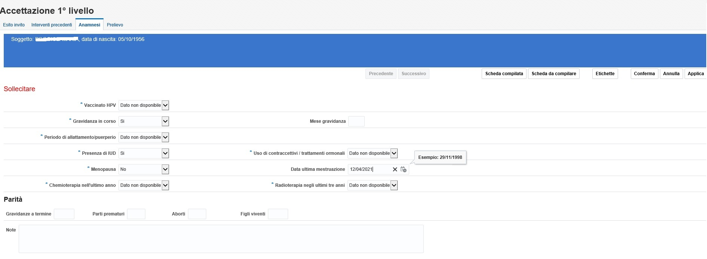

# Gestionale per gli Screening Oncologici

I Programmi di Screening Oncologici di Sanità Pubblica hanno lo scopo di ridurre la mortalità favorendone una corretta e precoce diagnosi al fine di contribuire ad aumentare le possibilità di guarigione.

A tal fine il Software di Screening di Azienda Zero contribuisce a dare un valido supporto agli operatori a partire dalla gestione della segreteria, gestione degli inviti e risposte, fino a coprire l’intero percorso di I, II e III livello dedicato al personale clinico.

### Descrizione ed ambito
Gli screening coinvolti sono essenzialmente tre:

- Screening Cervicale
- Screening Mammografico
- Screening Colon Retto

A questi si sono aggiunti in seguito gli Screening:
- Cardiovascolare
- Covid-19

Il Software di Screening di Azienda Zero è destinato ad essere utilizzato da diversi profili utente quali impiegati amministrativi con sole funzioni di accettazione, tecnici di laboratorio e radiologia per la gestione della validazione tecnica e personale laureato - medici o biologi - per le funzioni di validazione e compilazione dei dati che potranno essere utilizzati per la compilazione delle lettere di risposta.
Una volta identificata l’anagrafe aziendale a cui far riferimento, e stabilito quali sono i comuni coinvolti, la Segreteria dello Screening procede ad elaborare gli inviti generando le opportune lettere da inviare alla popolazione target.
Per lo Screening Citologico la fascia d’età generalmente è compresa tra i 25 ed i 64 anni (distinta in 25-33 per i progetti afferenti al PAP TEST Primario e 34-64 per i progetti afferenti ad HPV Primario).
Per lo Screening Mammografico la fascia d’età generalmente è compresa tra 50 ed i 69.
Per lo Screening del Colon Retto la fascia d’età generalmente è compresa tra 50 ed i 69.

Le fasce d’età sono comunque configurabili, in quanto i programmi nazionali posso variare nel tempo.
Una volta registrata l’adesione dei pazienti all’esame proposto, il programma consentirà la compilazione delle maschere inerenti l’accettazione e l’anamnesi.
In caso di test con esito negativo, quest’ultimo potrà essere comunicato al cittadino tramite lettera di risposta (con possibilità di scelta tra la stampa locale o l’invio tramite flusso di postalizzazione).
In caso di positività dell’esito, il cittadino verrà ricontattato per essere sottoposto agli opportuni approfondimenti ed eventualmente a trattamento chirurgico.
Il flusso operativo globale è illustrato di seguito.


I flussi operativi dettagliati per singolo Screening sono illustrati di seguito.


### Maschere principali del software

Gli operatori saranno provvisti di opportune credenziali d’accesso, ed una volta autenticati visualizzeranno le funzionalità associate al loro ruolo. La fase di autenticazione è delegata al sistema LDAP del cliente, mentre la fase di autorizzazione è gestita dal software di Screening.

La pagina iniziale sarà la Home Page. Nell’esempio viene visualizzato un Menu completo di funzionalità associate ad un utente che ha la possibilità di effettuare tutte le operazioni possibili all’interno dello screening cervicale.


Il primo passo per iniziare un percorso di Screening corretto è l’individuazione della popolazione target da invitare e la creazione dei Primi Inviti.
La funzionalità, dedicata essenzialmente agli operatori di Segreteria, si attiva cliccando la voce di menù Inviti.


Dopo aver immesso gli opportuni filtri sarà visualizzato l’elenco dei cittadini da invitare.

Dalla voce di menu Soggetto è possibile effettuare una ricerca impostando vari filtri;
sarà poi visualizzato in basso il relativo dettaglio.


Evidenziando poi la riga del paziente, e scorrendo i pulsanti in alto, si potranno avere i dettagli delle altre informazioni relative al paziente:

- informazioni relative all’invito corrente
- informazioni anagrafiche
- eventuali esclusioni
- informazioni relative alla Storia del Soggetto


Dopo aver selezionato il paziente si potrà procedere con l’anamnesi e l’accettazione.





Per ogni paziente si potrà poi procedere con l’assegnazione degli esiti dei singoli esami e la chiusura dell’episodio che assegnerà l’opportuno richiamo.

Ad esempio per lo screening Cervicale sarà il risultato dell’esame del singolo PAP TEST, o HPV, o la combinazione dei due esiti.


Per lo screening Mammografico sarà il risultato della mammografia bilaterale di I livello, con l’esito della Prima lettura, Seconda lettura ed eventuale Revisione.


Per lo screening del Colon Retto sarà il risultato del test del sangue occulto delle feci.


Nel caso in cui, i Soggetti aderenti allo Screening di I livello, abbiano ricevuto un esito positivo, sarà avviata la procedura di richiamo per effettuare gli approfondimenti del caso di II livello, fino ad arrivare eventualmente all’Intervento Chirurgico di III livello.

Nelle schede dedicate al II e III livello sarà possibile compilare i dati relativi a Colposcopie, Istologie, Mammografie di II livello, Ecografie, Biopsie, Colonscopie, ed eventualmente in caso di invio ad Intervento le schede per la compilazione degli Interventi chirurgici effettuati


L’inserimento manuale degli esiti di 1 livello, per quanto sempre possibile, è generalmente sostituito dai flussi di integrazione con i gestionali atti alla refertazione, ovvero con i LIS per lo screening del colon-retto, con i verticali di anatomia patologica per lo screening cervicale e con i RIS per lo screening mammografico.

---
### Aspetti tecnologici
L’applicativo per la gestione degli Screening Oncologici è sviluppato in Oracle Application Development Framework 12c.

#### Requisiti hardware  e software

TODO

#### Utenti del Sistema
Gli utenti del Sistema saranno utenti interni alla Regione, appartenenti alle Direzioni Regionali Sanitarie/Socio-Sanitarie e Sociali, alle Aziende Sanitarie Locali e alle Segreterie di Screening.

#### Configurazione

- aprire o installare Oracle JDeveloper 12g Versione 12.2.1.0.0.
- scaricare da GIT il progetto
```shell
$ git clone https://github.com/aziendazero/Screening.git
```

- da JDeveloper nella finestra Applications scegliere "Open Application..." e selezionare il file Screening.jws contenuto all'interno del progetto
- per buildare il file .ear, dal menu "Deploy", selezionare il profilo "Screening_Project1_Screening to EAR file"
- avviare o installare GlassFish Server Open Source Edition 4.1
- aprire la console di Glassfish, dal menu Resource > JDBC creare una nuova JDBC Connection Pool e una nuova JDBC Resource denominata "jdbc/ScreeningDS"
- nel menu "Application" creare un nuovo "Deploy" selezionando dal file system il file Screening.ear creato al punto precedente e proseguire


#### Status del progetto

- stabile

#### Limitazioni sull'utilizzo del progetto:

Il presente modulo della piattaforma documentale è stato realizzato facendo uso di Oracle RDBMS e Oracle Application Development Framework 12c.

___
#### Detentore del copyright:
Regione del Veneto
___
#### Soggetto incaricato del mantenimento del progetto open source:
| GPI SpA |
| :------------------- |
| Via Ragazzi del ‘99, 13 - 38123 Trento |
| Tel. 0461 381515 - Fax 0461 381599 |
| www.gpi.it |
___
#### Indirizzo e-mail a cui inviare segnalazioni di sicurezza:
info@gpi.it

## Licenza
Questo progetto è coperto da una licenza [GNU Affero General Public License v3.0 o successiva](LICENSE.txt).